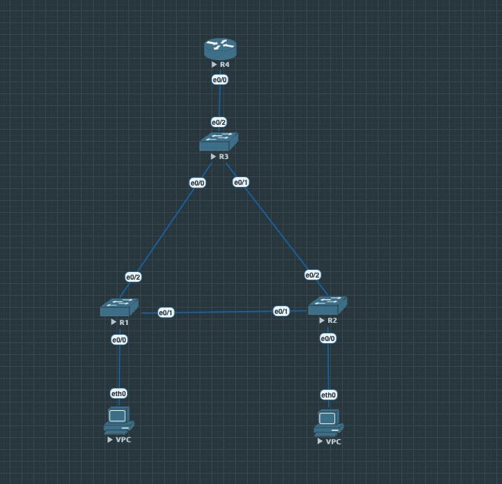

Давайте опишу тут процесс настройки каждого из свитчей и роутера. 

Свитчи все настраиваются полностью одинаково, говорим всем что есть vlan 10 и vlan 20, далее делаем на них access trunk, чтобы свитчи спокойно пересылали пакеты друг другу. 
Интерфейсы, соединяющие тачки и свитчи должны быть настроены чуть по-другому, а именно мы должны настроить их только на один VLAN, потому что они не должны получать пакеты из соседних. 
На роутере мы настраиваем айпишники. Также для выполнения всех условий мы еще должны сделать приоритет у мостов, соединяющих коммутатор уровня распределения с другими коммутаторами выше, так как мы сначала должны посылать пакеты через них по условию. Для этого тоже будет отдельная команда. 

Итак, давайте приступим к самим командам. 

Нет смысла описывать R1, R2 по-отдельности, потому что это одно и то же, только в некоторых местах надо поменять 10 на 20. Поэтому опишу только R1. Очень надеюсь что ничего не забуду, так как пишу руками.

```
> en
> conf t
> hostname switch1

> vlan 10
> exit
> vlan 20
> exit

> interface Ethernet 0/0
> switchport mode access
> switchport access vlan 10
> exit

> interface Ethernet 0/2
> switchport trunk encapsulation dot1q  // почему-то кстати не работало просто mode trunk, пришлось гуглить и это помогло. 
> switchport mode trunk
> switchport trunk allowed vlan 10,20
> exit

> interface Ethernet 0/1
> switchport trunk encapsulation dot1q
> switchport mode trunk
> switchport trunk allowed vlan 10,20
> exit
> exit
> wr
```

Теперь R3. Он настраивается полностью аналогично, только вместо работы с VPC надо настроить работу с роутером, которая ничем не отличается от работы с другими коммутаторами, а также надо настроить приоритеты, о которых я говорил в начале. 

```
> en
> conf t
> hostname switch3

> vlan 10
> exit
> vlan 20
> exit
> interface Ethernet 0/2
> switchport trunk encapsulation dot1q
> switchport mode trunk
> switchport trunk allowed vlan 10,20
> exit

> interface Ethernet 0/1
> switchport trunk encapsulation dot1q
> switchport mode trunk
> switchport trunk allowed vlan 10,20
> exit

> interface Ethernet 0/0
> switchport trunk encapsulation dot1q
> switchport mode trunk
> switchport trunk allowed vlan 10,20
> exit

> spanning-tree vlan 10 root primary  // делаем путь рутовым (это как раз то, про что я говорил про приоритеты)
> spanning-tree vlan 20 root primary
> wr
```

Осталось настроить тачки и роутер. Давайте к роутеру.

```
> en
> conf t

> interface Ethernet 0/0
> no shutdown // в приложенной статье описывается, зачем это делается

> interface Ethernet 0/0.10
> encapsulation dot1Q 10
> ip address 10.0.10.42 255.255.255.0
> exit

> interface Ethernet 0/0.20
> encapsulation dot1Q 20
> ip address 10.0.20.42 255.255.255.0
> exit

> wr
```

Кажется с роутером все. В нем втупую настраиваем айпишники как в статье и делаем no shutdown для нулевого интерфейса.
Остались тачки. Опишем только одну. Все что надо сделать - прописать одну команду с айпишником. 

```
ip 10.0.10.1 255.255.255.0 10.0.10.42
```

Для проверки я использовал ping с одной тачки на другую и EVE wireshark чтобы посмотреть, какие пакеты через что проходят. Статья - https://habr.com/ru/post/319080/. Видимо нужно еще приложить фотку топологии. Вот она


